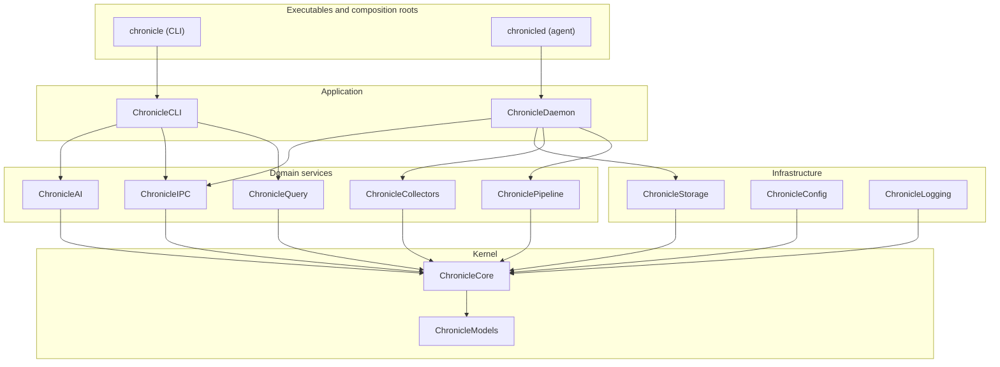
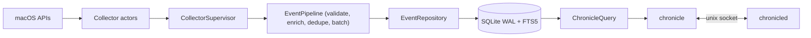

# Architecture

Chronicle follows Clean/Hexagonal architecture: dependencies point inward, and the
concrete types meet only in the executable composition roots. See
[`docs/adr`](../adr) for the decisions behind this.

## Layers

- **Kernel** (`ChronicleModels`, `ChronicleCore`) has no external dependencies and
  defines the value types and protocol boundaries (`EventCollector`,
  `EventRepository`, `SearchRepository`, `StatisticsRepository`,
  `EmbeddingRepository`, `EventProcessor`, `WallClock`, `IdentifierFactory`).
- **Infrastructure** implements those protocols (`ChronicleStorage` on SQLite/GRDB,
  `ChronicleConfig` on TOML, `ChronicleLogging` on swift-log).
- **Domain services** hold the behaviour: the ingestion pipeline, collectors,
  query engine, AI, and IPC contract.
- **Application** wires everything in the two executables.

## Runtime data flow

The agent (`chronicled`) is a per-user LaunchAgent. Collectors emit `RawEvent`s;
the pipeline turns them into `Event`s and batches them to storage. The CLI reads
the database directly (WAL allows concurrent readers) and controls the agent over a
Unix domain socket.

## Packages and responsibilities

| Package | Responsibility |
|---------|----------------|
| `ChronicleModels` | Value types: `Event`, `EventKind`, `JSONValue`, UUIDv7 ids. |
| `ChronicleCore` | Protocol boundaries, `EventQuery`, typed errors, `WallClock`. |
| `ChronicleLogging` | Structured, rotating JSON logging. |
| `ChronicleConfig` | Layered TOML config, paths, hot-reload watcher. |
| `ChronicleStorage` | SQLite/GRDB store, migrations, FTS5, embeddings. |
| `ChroniclePipeline` | Validate/enrich/dedupe/batch ingestion. |
| `ChronicleCollectors` | The nine collector modules + registry. |
| `ChronicleIPC` | Versioned control protocol over a Unix socket. |
| `ChronicleDaemon` | Agent orchestration, supervisor, LaunchAgent. |
| `ChronicleQuery` | Time ranges, search grammar, ranking, sessions, narrative. |
| `ChronicleAI` | Embeddings, semantic search, summarizers, redaction. |
| `ChronicleCLI` | The `chronicle` command surface and output rendering. |
